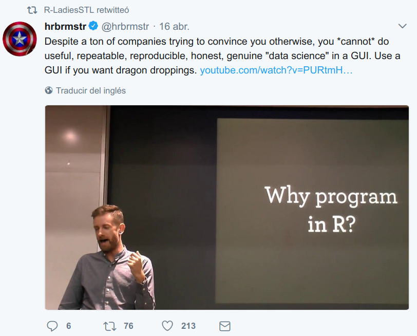
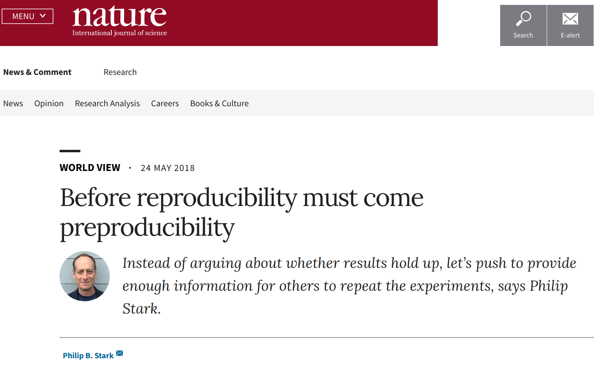
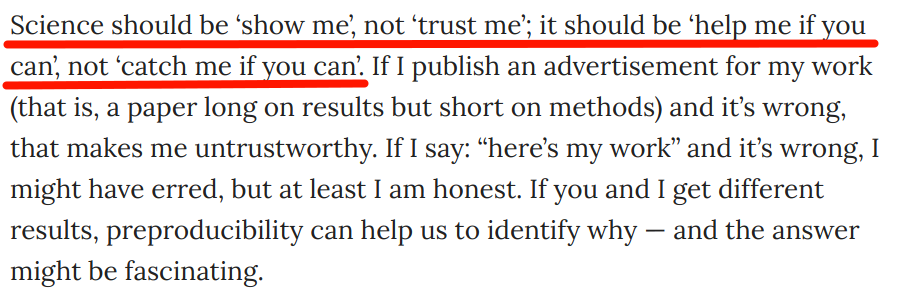
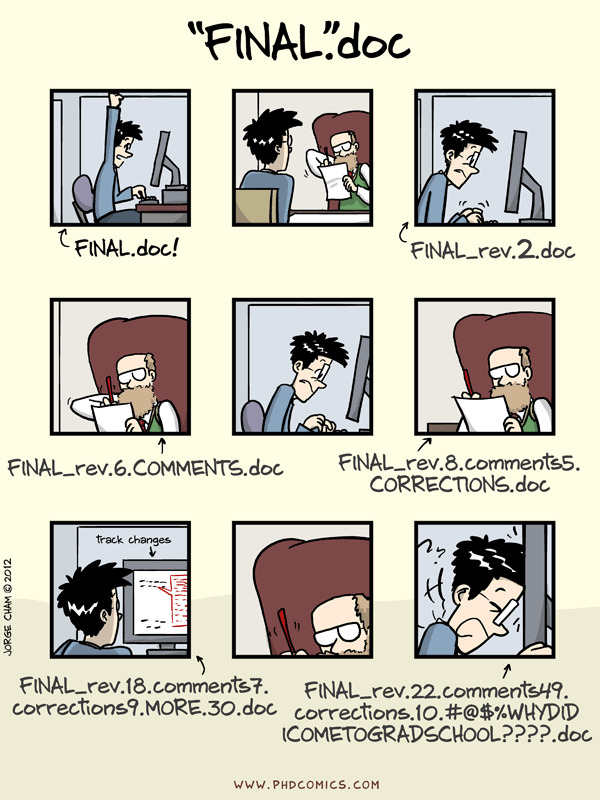
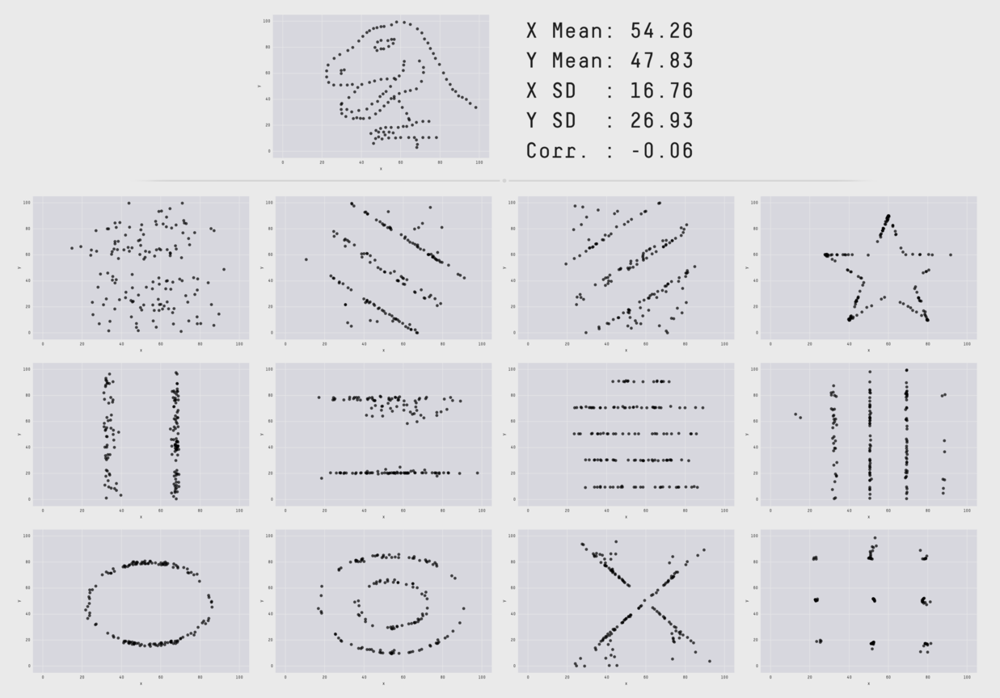

<!-- Este .md fue generado a partir del .Rmd homónimo. Edítese el .Rmd -->

## Intro

### Expectativas.

### El ecosistema del curso

Sitúa los recursos de los que dispondrás en el curso.

- Cuenta en mi jupyterHub. Credenciales y ruta enviadas por correo.

- Recomendado en tu PC. Instala R+RStudio.

- GitHub, o GitLab o BitBucket. Tener una cuenta en GitHub es opcional para este curso, pero altamente recomendada. Quizá ya dispones de una cuenta en GitHub, pero no es obligatorio para hacer consultas (este texto se encuentra en GH y no se requiere tener una cuenta para consultarlo), sólo para crear tu propio contenido. Si quieres tener tu código alojado en la nube, disponible para ti y para "la comunidad", entonces usa alguna de estas "redes sociales de desarrolladores".

- Vídeos tutoriales en YouTube y repo de Github. Los vídeos tutoriales se encuentran alojados en la lista de reproducción ["Ecología numérica con R"](https://www.youtube.com/playlist?list=PLDcT2n8UzsCRDqjqSeqHI1wsiNOqpYmsJ). Estos vídeos se asocian con *scripts* de R que puedes usar como fuente, y se encuentran en el repo [Scripts de análisis de BCI](https://github.com/biogeografia-master/scripts-de-analisis-BCI). No es necesario clonar dicho repo (más adelante explico en detalle), es preferible visualizarlo desde GitHub, como verás en los vídeos tutoriales en cada caso (detalles en el próximo apartado).

- ChatGPT de OpenAI. Recomendado crearse cuente.

### ¿Por qué R?

**En corto**: R cuenta con múltiples herramientas de análisis ecológico y para crear flujos de trabajo reproducibles.

**En detalle**: Además de sus capacidades para análisis estadísticos avanzados, R se caracteriza por lo siguiente:

  - Dispone de un "ecosistema" de paquetes para análisis de datos ecológicos y ambientales muy nutrido. Consulta este [CRAN Task View](https://cran.r-project.org/web/views/Environmetrics.html) para más detalles.

  - [Cuenta con potentes y versátiles herramientas de representación gráfica](https://www.r-graph-gallery.com/)

  - Existen varios entornos de desarrollo integrado (IDE) orientados a la reproducibilidad y al control de versiones (e.g. [RStudio](https://rstudio.com/)).
  
  - ¡ES LIBRE\!
  
  - Utiliza intérprete de órdenes (consola), lo cual podría parecer un obstáculo, pero es a fin de cuentas una gran ventaja. Los programas basados en interfaz gráfica difícilmente garantizan reproducibilidad, y no disponen de todas las herramientas de análisis y representación con las que cuenta R.
  
  - Cuenta con la diversa y activa comunidad R, que promueve el uso de este entorno de programación, y a la vez ofrece apoyo para dudas concretas e incluso para formar una comunidad R local.

### Software libre, paradigma, reproducibilidad y control de versiones

- Software libre, código abierto.

- Programación orientada a objetos.

- **Demo**. Un vistazo rápido a cuadernos Jupyter, JupyterHub, JupyterLab

- **Demo**. Un vistazo rápido a R y a la IDE RStudio (¿Qué es R?).

- Reproducibilidad (Markdown, cuadernos RMarkdown).

&nbsp;

<figure>

<figcaption>Why program in R?</figcaption>
</figure>

&nbsp;

<figure>

</figure>

<figure>

<figcaption>Reproducibilidad y preproducibilidad</figcaption>
</figure>

&nbsp;

<figure>

<figcaption>Tarjeta perforada</figcaption>
</figure>

&nbsp;

- **Demo**. Probemos un sencillo ejemplo para demostrar la utilidad de los cuadernos RMD de dos formas distintas:

  - Desde cero.
  
  - Un manuscrito.

- **Demo**. Probemos un sencillo ejemplo para demostrar la utilidad de los cuadernos Jupyter desde cero con ayuda de IA.

- Control de versiones (Git, GitHub).

&nbsp;

<figure>

<figcaption>Fuente: <a href="http://phdcomics.com/comics/archive_print.php?comicid=1531">http://phdcomics.com/comics/archive_print.php?comicid=1531</a></figcaption>
</figure>

&nbsp;

- ¿Para qué me sirve la cuenta de GitHub?

  - En mis clases en la UASD, antes Git y GitHub eran imprescindibles, aunque en este curso son sólo herramientas "recomendadas". En cualquier caso, recuerda usar siempre alguna forma de control de versiones.
  
  - **Demo**: Iniciar sesión en GitHub > Buscar repo > Fork > Clone > [Identificarme] > Commit > Push > Ver cambios

### ¿Cómo instalar R y RStudio?

No necesitas R y RStudio en este curso, pero si lo necesitaras a futuros, aquí te transcribo a continuación algunos punteros de vídeos-tutoriales recientes que explican cómo instalarlos a ambos. Lógicamente, la instalación es diferente según el sistema operativo, pero mi recomendación más importante es la siguiente: **sólo instala programas que procedan de fuentes confianza**. El repositorio oficial de R se llama [CRAN](https://cran.r-project.org/).

  - Linux, GNU/Linux o *whatever*. Lee en el CRAN, pero también [este vídeo](https://www.youtube.com/watch?v=RDUED5LHEfE) lo explica (no sé si sea el más didáctico, pero es reciente y completo). Puedo ofrecer soporte sobre cómo instalar en este sistema operativo (los puristas dicen que no es un sistema operativo).
  
  - Windows. En el CRAN encontrarás la instalación, y [este vídeo](https://www.youtube.com/watch?v=h2IPWVXaUuU) me pareció completo. No puedo ofrecer soporte sobre cómo instalar R en este sistema operativo, aunque quizá puedo aportar ideas generales.
  
  - macOS. No puedo sugerir nada aquí, así que mejor buscar opciones por tu propia cuenta. En todo caso, la [página del CRAN](https://cran.r-project.org/bin/macosx/) sobre cómo instalar en macOS luce detallada
  
  - Si tienes experiencia en contenedores, prueba con Docker. Esta opción tiene múltiples ventajas, como por ejemplo: 1) No tienes que pelearte con el infierno de las dependencias; 2) Normalmente, las imágenes de Docker de R incorporan de serie varios paquetes muy populares; 3) Dispondrás de RStudio Server y, dependiendo de la imagen que descargues, del servidor Shiny.

## Análisis de biodiversidad

### La parcela permanente de 50-ha de árboles de Barro Colorado Island (BCI).

Para obtener resultados empíricos consistentes, se necesitan datos de comunidad y ambientales de calidad. El [conjunto de datos de BCI](http://ctfs.si.edu/webatlas/datasets/bci) es idóneo en este sentido, puesto que dispone de múltiples variables ambientales e información de la comunidad basada en repetidos censos desde la década de los 80 del siglo XX (Condit, 1998; Hubbel et al., 1999; Hubbel et al., 2005). Los datos están bien documentados y contienen todas las variables necesarias para cualquier análisis de ecología numérica.

Puedes consultar más en estos vídeos.

- [Vídeo sugerido (versión en español): Un vistazo a la ciencia y los cientificos que trabajan en la isla de Barro Colorado](https://www.youtube.com/watch?v=bN54RGtxFeM)

- [Vídeo sugerido (versión original en inglés): Barro Colorado Island: BCI - Official Video - Smithsonian Tropical Research Institute in Panama](https://www.youtube.com/watch?v=tRGG-XmNMhk)

- [Vídeo sugerido: Datos censales parcela permanente 50 ha árboles BCI, explicado por el tali](https://www.youtube.com/watch?v=Hm6yO_V6NUY&list=PLDcT2n8UzsCRDqjqSeqHI1wsiNOqpYmsJ&index=1)

### Una rápida intro a R

-  **Demo**. Objetos en R. Creé [este tutorial](https://geofis.shinyapps.io/tutorial1/) hace ya algún tiempo, pero pienso que sigue siendo útil. **Demo** en vivo.

### Análisis exploratorio de datos (AED). ¿Por qué? Matrices de comunidad y ambiental.

<figure>

<figcaption>The Datasaurus Dozen. Aunque diferentes en apariencia, cada conjunto de datos tiene el mismo resumen estadístico (media, desviación estándar y correlación de Pearson) a dos posiciones decimales. Fuente: <a href="https://www.autodesk.com/research/publications/same-stats-different-graphs">https://www.autodesk.com/research/publications/same-stats-different-graphs</a></figcaption>
</figure>

&nbsp;

- [Vídeo sugerido: Análisis exploratorio de datos, parte 1. Objetos en R, insertar en documento RMarkdown. Recomendado hasta el minuto 23:30](https://www.youtube.com/watch?v=vRWoqzJrnk4&list=PLDcT2n8UzsCRDqjqSeqHI1wsiNOqpYmsJ&index=4)

  > En el vídeo tutorial, así como en los siguientes, verás que me refiero a scripts que disponen de dos versiones cada uno: una versión Markdown (archivo `.md`) y una versión R (archivo `.R`). Para reproducir análisis Utiliza la versión *Raw*" del archivo`.R`, porque desde ésta podrás copiar código y pegarlo en R sin problemas. La otra versión, la `.md`, te sirve para ver el resultado "tejido" que obtendrías al ejecutar cada script.
  
- **Demo**. AED con ayuda de IA.

Cierre del primer día.

- [Vídeo sugerido: Análisis exploratorio de datos, parte 2. Tutorial de tidyverse. T1:48:09](https://www.youtube.com/watch?v=YiUmteAbLt8&list=PLDcT2n8UzsCRDqjqSeqHI1wsiNOqpYmsJ&index=5)

  > Complementar con [este ejemplo](pipa-no-pipa.md) sobre el uso de la pipa `%>%` en R.

- [Vídeo sugerido: Análisis exploratorio de datos, parte 3. Mapas de riqueza y abundancia. T35:31](https://www.youtube.com/watch?v=okMDGdgQ1EM&list=PLDcT2n8UzsCRDqjqSeqHI1wsiNOqpYmsJ&index=6)

- [Vídeo sugerido: Análisis exploratorio de datos, parte 4. Mapas de variables ambientales. T27:37](https://www.youtube.com/watch?v=qe7qD03n0jI&list=PLDcT2n8UzsCRDqjqSeqHI1wsiNOqpYmsJ&index=7)

- [Vídeo sugerido: Análisis exploratorio de datos, parte 5. Paneles de correlación. T40:39](https://www.youtube.com/watch?v=xfKGOWNyJVc&list=PLDcT2n8UzsCRDqjqSeqHI1wsiNOqpYmsJ&index=8)

- [Vídeo sugerido: Análisis exploratorio de datos, parte 6. Mapas de variables ambientales por lotes. T15:33](https://www.youtube.com/watch?v=SNYhP5mqlTQ&list=PLDcT2n8UzsCRDqjqSeqHI1wsiNOqpYmsJ&index=9)

### Medidas de asociación: distancia.

- **Demo**. [Vídeo sugerido: Medición de asociación, parte 1. Teoría sobre los modos Q y R, Orlóci. T29:12](https://www.youtube.com/watch?v=yQ10lp0-nHc&list=PLDcT2n8UzsCRDqjqSeqHI1wsiNOqpYmsJ&index=10)

- [Vídeo sugerido: Medición de asociación, parte 2. Modo Q aplicado. T36:11](https://www.youtube.com/watch?v=M3GfFzkJFys&list=PLDcT2n8UzsCRDqjqSeqHI1wsiNOqpYmsJ&index=11)

- [Vídeo sugerido: Medición de asociación, parte 3. Modo R aplicado. T28:16](https://www.youtube.com/watch?v=mef9NIjXBWY&list=PLDcT2n8UzsCRDqjqSeqHI1wsiNOqpYmsJ&index=12)

### Análisis de agrupamiento (cluster analysis).

- [Vídeo sugerido: Análisis de agrupamiento (cluster analysis), parte 1. Agrupamiento jerárquico. T38:14](https://www.youtube.com/watch?v=AW5L-uZlEvk&list=PLDcT2n8UzsCRDqjqSeqHI1wsiNOqpYmsJ&index=13)
      
- **Demo**. [Vídeo sugerido: Análisis de agrupamiento (cluster analysis), parte 2. Interpretación/comparación de resultados. T1:11:54](https://www.youtube.com/watch?v=y1ZZh9ajT_U&list=PLDcT2n8UzsCRDqjqSeqHI1wsiNOqpYmsJ&index=14)
      
- [Vídeo sugerido: Análisis de agrupamiento, parte 3. Grupos (clústers), variables ambientales y mapas. T33:49](https://www.youtube.com/watch?v=ZrXpgDAaDo8&list=PLDcT2n8UzsCRDqjqSeqHI1wsiNOqpYmsJ&index=15)
      
- [Vídeo sugerido: Análisis de agrupamiento, parte 4. Asociación de especies con hábitats. T55:05](https://www.youtube.com/watch?v=JK7hq71onKs&list=PLDcT2n8UzsCRDqjqSeqHI1wsiNOqpYmsJ&index=16)

### Análisis de ordenación.

- **Demo**. [Vídeo sugerido: Técnicas de ordenación, parte 1. Ordenación no restringida o 'simple'. T2:08:05](https://www.youtube.com/watch?v=xLFz4WRgoDE&list=PLDcT2n8UzsCRDqjqSeqHI1wsiNOqpYmsJ&index=17)

- [Vídeo sugerido: Técnicas de ordenación, parte 2. Ordenación restringida o 'canónica'. T1:11:44](https://www.youtube.com/watch?v=bKyBGxNotgM&list=PLDcT2n8UzsCRDqjqSeqHI1wsiNOqpYmsJ&index=18)

### Análisis de diversidad.

- **Demo**. [Vídeo sugerido: Análisis de diversidad, parte 1. Diversidad alpha. T1:45:15](https://www.youtube.com/watch?v=QVfVH2bVJbM&list=PLDcT2n8UzsCRDqjqSeqHI1wsiNOqpYmsJ&index=19)

- [Vídeo sugerido: Análisis de diversidad, parte 2. Diversidad beta. T23:29](https://www.youtube.com/watch?v=rJ67sF0hYuE&list=PLDcT2n8UzsCRDqjqSeqHI1wsiNOqpYmsJ&index=20)

### Referencias

1. Repo de *scripts*, que dispone de un DOI, el cual puedes usar para referirlo:  , o puedes usar esta [entrada BibTeX](https://github.com/biogeografia-master/scripts-de-analisis-BCI#entrada-bibtex)

2. Manual de referencia (en inglés), para dudas específicas: Borcard, D., Gillet, F., & Legendre, P. (2018). **Numerical ecology with R**. Springer.